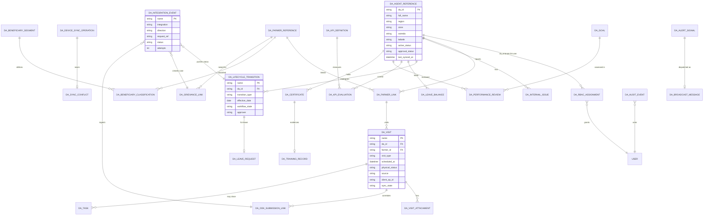

# DA Services data model

Design baseline for every doctype the `da_services` Frappe app will own. Agree this
before building feature doctypes so each one is created once against a reviewed schema.

Status: **draft for team review** (Pushkar: field services; Yash: registry boundary;
Shikha: field names and vocabularies). Open questions are collected at the end.

Sources: FSD D3 (section 5 data model, 3.x functional requirements, Part 2 sections,
Appendix A), Part 1 HLD (sections 5, 7, 9, 10.3), DA Services Part 2 brief (sections
8–25), DA Registry field list (Shikha), staging portal, and what is already built
(`DA RBAC Assignment`, `DA Audit Event`).

---

## 1. Principles

1. **One authoritative owner per fact** (HLD 2.2). DA identity and posting live in the
   DA Registry (OpenG2P Gen 2); farmer master in the Farmer Registry; grievance cases in
   the Grievance Service; survey submissions in ODK Central. DA Services stores
   references, read-only projections where a page needs them, and its own operational
   records. It never becomes a second master and never edits another system's data
   directly.
2. **Operational facts are ours.** Visits, tasks, sync queue, leave, lifecycle
   decisions, KPIs, reviews, training, incentives, feedback issues, notifications,
   broadcasts: created and owned here.
3. **Every mutation is auditable and idempotent** (HLD 8.1, 10.3). Device-originated
   records carry a client operation id; outbound integrations carry a request reference;
   security-relevant actions write `DA Audit Event`.
4. **Status vocabularies come from the FSD/HLD**, not invented per screen (Appendix A of
   the HLD for sync states; FSD section 4 for workflow states).
5. **Physical work and synchronisation are separate state dimensions** (HLD 9.4): a
   visit's `physical_status` never changes because a sync failed.

---

## 2. Conventions

| Topic | Convention |
|---|---|
| Doctype names | Prefix `DA ` (e.g. `DA Visit`) so names cannot collide with other OAN apps on a shared bench |
| Naming series | `format:DA-<3-letter code>-{YYYY}-{#######}` for operational records; natural keys for lookups |
| External references | Plain `Data` fields, indexed: `da_id`, `farmer_id`, `external_case_id`, `submission_id`. Masters are external, so no `Link` |
| Users | `Link` to `User`; the DA user ↔ DA-ID binding comes from `DA RBAC Assignment` |
| Administrative codes | `region`, `zone`, `woreda`, `kebele` as codes (`Data`) today; `Link` to `DA Administrative Area` once the master is synced (migration path noted) |
| Device fields | `client_op_id` (unique per device operation, idempotency), `device_id`, `captured_at`, `sync_state` using the HLD 9.1 vocabulary |
| Timestamps | Frappe `creation`/`modified` plus domain times (`scheduled_at`, `completed_at`, `applied_at`) where they differ (HLD 10.3 "captured, submitted, processed, applied") |
| Attachments | Child table with `file` (Link File), `kind`, `content_hash`, `captured_at`; dedupe by hash (HLD 9.2) |
| Soft history | Nothing user-facing is hard-deleted: revoke, end, cancel, supersede. Registry-mirrored fields are read-only |
| Localisation | Labels in English and Amharic where shown to farmers/DAs: `*_en`, `*_am` on lookup and content doctypes |
| Permissions | DocPerms per role + `permission_query_conditions`/`has_permission` hooks for scope (pattern already in `permissions.py`). Every new doctype registers both before exposure |
| Audit | `track_changes: 1` on operational doctypes; `DA Audit Event` for denials, approvals, assignments, lifecycle decisions, integration outcomes |

---

## 3. Doctype inventory

Phases follow the Part 2 brief order adapted to the DA role first.

| # | Doctype | Group | Phase | Owner of the fact |
|---|---|---|---|---|
| 1 | DA RBAC Assignment | Access | ✅ built | Services |
| 2 | DA Audit Event | Access | ✅ built | Services |
| 3 | DA Administrative Area | Reference | 2 | Master data / GIS (read-only here) |
| 4 | DA Reference Value | Reference | 2 | Services (config) |
| 5 | DA Agent Reference | Registry bridge | 2 | **DA Registry** (read-only projection) |
| 6 | DA Profile Change Request | Registry bridge | 2 | Services (request) → Registry (result) |
| 7 | DA Farmer Link | Field | 2 | Services |
| 8 | DA Farmer Reference | Field | 2 | **Farmer Registry** (read-only projection) |
| 9 | DA Visit (+ DA Visit Attachment) | Field | 2 | Services |
| 10 | DA Task | Field | 2 | Services |
| 11 | DA ODK Submission Link | Field | 2 | ODK Central (state) / Services (correlation) |
| 12 | DA Beneficiary Segment / DA Beneficiary Classification | Field | 2 | Services |
| 13 | DA Device Sync Operation / DA Sync Conflict | Sync | 2 | Services |
| 14 | DA Grievance Link | Field | 2 | Grievance Service (case) / Services (link) |
| 15 | DA Internal Issue (+ child tables) | Field | 2 | Services |
| 16 | DA Notification | System | 2 | Services |
| 17 | DA Integration Event | System | 2 | Services |
| 18 | DA Lifecycle Transition | Part 2 | 3 | Services (decision) → Registry (status) |
| 19 | DA Leave Request / DA Leave Balance | Part 2 | 3 | Services |
| 20 | DA KPI Definition / DA KPI Evaluation | Part 2 | 4 | Services |
| 21 | DA Goal (+ assignees) | Part 2 | 4 | Services |
| 22 | DA Performance Review | Part 2 | 4 | Services |
| 23 | DA Certificate / DA Training Record | Part 2 | 5 | Services (uploads) / Agrilearn (auto) |
| 24 | DA Incentive Eligibility | Part 2 | 5 | Services |
| 25 | DA Advisor | Part 2 | 6 | Services (reference directory) |
| 26 | DA Knowledge Article / DA Knowledge Dispatch | Communication | 6 | Services |
| 27 | DA Alert Signal / DA Broadcast Message (+ receipts) | Communication | 6 | Services + provider receipts |
| 28 | DA Survey Template / Parameter / Deployment / Response | Survey (D28) | 6 | Services |

Field types below use Frappe names: Data, Int, Float, Check, Date, Datetime, Select,
Link, Table, Small Text, Text, JSON, Attach.

---

## 4. Reference and registry bridge

### 4.1 DA Administrative Area (read-only lookup)

Tree of Region → Zone → Woreda → Kebele, refreshed from the master source. Never edited
in Desk. Source system is an open question (Catalog API, OpenG2P, or the seed the
Grievance app uses).

| Field | Type | Notes |
|---|---|---|
| `code` | Data, unique | e.g. `ET04`, `ET04-Z01`, `ET04-W01`, `ET04-W01-K03`; also the `name` |
| `level` | Select: Region / Zone / Woreda / Kebele | |
| `parent_area` | Link DA Administrative Area | `is_group` tree with `lft`/`rgt` for subtree queries |
| `name_en`, `name_am` | Data | |
| `active` | Check | |
| `boundary_ref` | Data | GIS boundary id/version for geofence checks |
| `source`, `source_version`, `last_synced_at` | Data / Data / Datetime | provenance |

### 4.2 DA Reference Value (dropdowns)

One generic lookup instead of a doctype per list. Lists: visit type, visit purpose,
task type, issue category, issue severity, grievance category, leave type, education
level, specialisation, position, certificate type, incentive type, broadcast audience
type, salutation, marital status.

| Field | Type |
|---|---|
| `list_type` | Select (the list names above) |
| `code` | Data; `name` = `{list_type}:{code}` |
| `label_en`, `label_am` | Data |
| `sort_order` | Int |
| `active` | Check |
| `meta` | JSON (e.g. SLA hours for a severity) |

### 4.3 DA Agent Reference (registry projection)

A **read-only cache** of the slice of the DA record our pages show (dashboard header,
Supervisor lists, scope checks). The registry remains the master; rows here are written
only by the registry sync or by the lookup client, never by users. Exists because
Supervisor lists over 50–100 DAs and search over tens of thousands cannot call the
registry per row (NFR: search p95 ≤ 2 s). Requires decision B1 (integration path).

| Field | Type | Notes |
|---|---|---|
| `da_id` | Data, unique (`name`) | |
| `full_name`, `salutation`, `father_name`, `grandfather_name` | Data | naming per Shikha's list; UI shows first/last — open question |
| `gender`, `marital_status` | Select | |
| `birth_month_ec`, `birth_year_ec` | Int | Ethiopian calendar, per field list |
| `phone`, `telegram`, `alternate_phone`, `email` | Data | |
| `education_level`, `specialisation`, `position` | Data (codes) | |
| `region`, `zone`, `woreda`, `kebele` | Data (codes) | assigned posting |
| `active_status` | Select: Active / On-leave / Separated | FSD 3.2.1 col 5 |
| `approval_status` | Select: Draft / Awaiting review / Changes requested / Approved / Published | |
| `fayda_status` | Select: Verified / Pending / Mismatch | |
| `joined_on` | Date | years of service |
| `photo_url` | Data | |
| `registry_version` | Data | optimistic concurrency when pushing outcomes |
| `last_synced_at`, `stale` | Datetime, Check | `stale` when older than policy |

Permissions: read for Supervisor (scoped by Woreda), Executive (Region), Admin; no
create/write for anyone (sync writes with `ignore_permissions`).

### 4.4 DA Profile Change Request

DA self-service edits (contact, demographics, household, qualifications) that need Woreda
approval before they reach the registry (FSD 3.7).

| Field | Type | Notes |
|---|---|---|
| `da_id`, `requested_by` (User) | Data / Link | |
| `section` | Select: Demographics / Contact / Household / Qualifications | self-service hub rows |
| `changes` | JSON | `{field: {from, to}}` |
| `attachments` | Table DA Attachment Row | evidence (certificate scans) |
| `status` | Select: Pending / Approved / Rejected / Changes requested / Applied | `Applied` = pushed to registry |
| `approver`, `decided_at`, `decision_note` | Link / Datetime / Small Text | |
| `registry_sync` | Link DA Integration Event | push result |
| `client_op_id`, `sync_state` | Data / Select | mobile origin |

---

## 5. Field services (DA role)

### 5.1 DA Farmer Link

The DA ↔ farmer relationship (FSD 3.5 agent–farmer association). Farmer master stays in
the Farmer Registry.

| Field | Type | Notes |
|---|---|---|
| `da_id` | Data, indexed | |
| `farmer_id` | Data, indexed | Farmer Registry id |
| `kebele` | Data | |
| `mode` | Select: Automatic / Manual | FSD 3.5 |
| `relationship_state` | Select: Active / Ended / Pending sync | |
| `linked_at`, `ended_at` | Datetime | |
| `set_by` | Link User | Supervisor for manual |
| `end_reason` | Small Text | |
| `client_op_id`, `sync_state` | | |

Unique: (`da_id`, `farmer_id`) where `relationship_state = Active`.

### 5.2 DA Farmer Reference (projection)

Read-only cache of what the My Farmers list and offline visit need: `farmer_id`
(name), `full_name`, `phone`, `kebele`, `household_size`, `plots_count`, `area_ha`,
`primary_crop`, `fayda_state`, `registered_on`, `registry_version`, `last_synced_at`.
Written only by the Farmer Registry adapter. Pending-action chips (Crop survey due,
Livestock due, Credit in review, Fayda check, No action due) are **derived** from
tasks/visits/ODK/credit status at read time, not stored (FSD 3.4).

### 5.3 DA Visit

| Field | Type | Notes |
|---|---|---|
| `name` | `DA-VIS-{YYYY}-{#######}` | |
| `da_id` | Data, indexed | |
| `farmer_id` | Data, indexed | optional for unplanned ODK-reported visits until matched |
| `kebele` | Data | |
| `visit_type` | Select: Crop Survey / Livestock Survey / Services / Advisory / Follow-up | FSD 3.6 |
| `purpose` | Data | |
| `scheduled_at` | Datetime | |
| `duration_min` | Int | expected |
| `priority` | Select: Normal / High / Urgent | |
| `location_lat`, `location_lng` | Float | from farmer parcel |
| `source` | Select: Planned / Unplanned / ODK-reported | HLD 6.5 |
| `physical_status` | Select: Planned / Confirmed / In progress / Physical Visit Complete / Missed / Rescheduled / Cancelled / Superseded | HLD 9.4; FSD 3.6 |
| `started_at`, `completed_at` | Datetime | DA's physical closure |
| `outcome` | Small Text | |
| `advice_given` | Text | |
| `gps_lat`, `gps_lng`, `gps_accuracy_m`, `gps_captured_at` | Float / Float / Float / Datetime | FR-05b-iv fix before survey |
| `notify_farmer_sms` | Check | plan dialog option |
| `rescheduled_from` | Link DA Visit | |
| `attachments` | Table DA Visit Attachment | `file`, `kind` (Crop / Land / Animal / Document), `content_hash`, `captured_at`, `sync_state` |
| `client_op_id`, `device_id`, `sync_state` | | |

Performance counting (HLD 9.4): a visit counts only when `physical_status = Physical
Visit Complete` **and** any required survey link is `Complete`.

### 5.4 DA ODK Submission Link

| Field | Type | Notes |
|---|---|---|
| `visit` | Link DA Visit | may be set after matching |
| `da_id`, `farmer_id` | Data | |
| `survey_type` | Select: Crop / Livestock | |
| `form_id`, `form_version` | Data | ODK form identity |
| `launch_mode` | Select: Assisted / Independent | |
| `instance_id`, `submission_id` | Data | ODK ids |
| `odk_state` | Select: Scheduled / In progress in ODK / Awaiting ODK upload / Submitted to ODK / Processing result / Complete / Needs Attention / Cancelled | HLD 9.4 |
| `match_result` | Select: Matched / Unplanned created / Ambiguous / Unmatched | |
| `duplicate_of` | Link DA ODK Submission Link | |
| `validation_result` | JSON | |
| `result_projection` | JSON | validated fields Part 1 needs |
| `last_checked_at` | Datetime | "Last checked at" qualifier |
| `ingestion_event` | Link DA Integration Event | |

### 5.5 DA Task

Explicit records behind the dashboard "Tasks" tile and today's plan. Most are
system-generated from rules (survey due, report due, follow-up); some manual.

| Field | Type | Notes |
|---|---|---|
| `da_id` | Data, indexed | |
| `task_type` | Select: Survey due / Report due / Follow-up / Fayda check / Credit review / Custom | |
| `title`, `description` | Data / Small Text | |
| `farmer_id`, `visit` | Data / Link | optional |
| `due_at` | Datetime | |
| `priority` | Select: Normal / Urgent | |
| `status` | Select: Open / Done / Cancelled | |
| `completed_at` | Datetime | |
| `generated_by_rule` | Data | rule id when system-generated |
| `client_op_id`, `sync_state` | | |

### 5.6 DA Beneficiary Segment and DA Beneficiary Classification

FSD 3.4 / HLD 6.6.

**DA Beneficiary Segment**: `code` (name), `title_en/_am`, `scheme`, `rule` (JSON),
`active`.

**DA Beneficiary Classification**

| Field | Type | Notes |
|---|---|---|
| `farmer_id` | Data, indexed | |
| `segment` | Link DA Beneficiary Segment | |
| `mode` | Select: Rule / Manual | |
| `active` | Check | |
| `reason`, `evidence` | Small Text / Table attachments | manual add |
| `actor_da_id`, `actor_user` | Data / Link | |
| `review_state` | Select: Not required / Pending / Reviewed | |
| `removal_note` | Small Text | required on removal |
| `previously_removed` | Check | never cleared by rules |
| `readd_intent` | Small Text | explicit statement when re-adding |
| `effective_from`, `effective_to` | Date | |
| `client_op_id`, `sync_state` | | |

Rule: a rule run may not set `active=1` on a row with `previously_removed=1`.

### 5.7 DA Device Sync Operation and DA Sync Conflict

**DA Device Sync Operation** (append-only queue of device commands)

| Field | Type | Notes |
|---|---|---|
| `client_op_id` | Data, unique (`name`) | idempotency key from the device |
| `device_id`, `da_id`, `user` | Data / Data / Link | |
| `entity_type` | Data | target doctype |
| `entity_name` | Data | set once applied |
| `operation` | Select: Create / Update / Action | |
| `payload` | JSON | |
| `payload_hash` | Data | |
| `captured_at`, `received_at`, `applied_at` | Datetime | HLD 10.3 times |
| `state` | Select: Queued / Uploading / Accepted / Validated / Rejected / Conflict / Retryable failure / Dead letter | HLD 9.1 |
| `attempts`, `last_error` | Int / Small Text | |
| `correlation_id` | Data | |

**DA Sync Conflict**

| Field | Type | Notes |
|---|---|---|
| `operation` | Link DA Device Sync Operation | |
| `entity_type`, `entity_name` | | |
| `field_diffs` | JSON | per field: device value, server value, server version |
| `resolution` | Select: Pending / Keep mine / Keep server / Merge | HLD 9.2; FSD 3.8 |
| `merged_payload` | JSON | |
| `resolved_by`, `resolved_at` | Link / Datetime | |
| `flag_for_supervisor` | Check | merged records are spot-checked |

### 5.8 DA Grievance Link

| Field | Type | Notes |
|---|---|---|
| `da_id`, `farmer_id` | Data | |
| `raised_for` | Select: Self / Farmer | |
| `external_case_id` | Data, indexed | from Grievance Service |
| `category`, `subject`, `priority` | Data | snapshot at raise time |
| `status_mirror` | Data | mapped external status |
| `last_status_at` | Datetime | |
| `api_sync_state` | Select: Queued / Submitted / Failed / Dead letter | |
| `submission_payload` | JSON | kept until submitted |
| `attachments` | Table | photo, voice note (queued offline) |
| `client_op_id` | | |

Case handling (triage, response, closure) is read from the Grievance Service, never
stored or edited here (FSD 3.12).

### 5.9 DA Internal Issue

FSD 3.13.

| Field | Type | Notes |
|---|---|---|
| `name` | `DA-ISS-{YYYY}-{#######}` | |
| `reporter_da_id`, `reporter_user` | Data / Link | |
| `woreda` | Data | routing to the Supervisor queue |
| `category` | Select: Equipment / Payment-incentive / Safety / Data-system / Operational | |
| `severity` | Select: Low / Medium / High | |
| `subject`, `description` | Data / Text | |
| `related_kebele`, `related_farmer_id` | Data | optional |
| `attachments` | Table | |
| `status` | Select: Draft / Queued / Submitted / New / In Review / Assigned / In Progress / Resolved / Closed / Rejected / Needs more info / Reopened | FSD 3.13 |
| `assignee` | Link User | |
| `priority` | Select | |
| `sla_due` | Datetime | from severity via DA Reference Value meta |
| `request_info_notes` | Table (note, by, at) | |
| `resolution_note` | Text | |
| `reopened_count` | Int | |
| `sync_state` | | Sync-failed auto-retry |

Native Frappe Workflow drives `status` (same approach as the Grievance app).

### 5.10 DA Notification

| Field | Type |
|---|---|
| `user` | Link User |
| `type` | Data (Appendix A event names) |
| `title`, `body` | Data / Small Text |
| `channel` | Select: App / SMS / Telegram |
| `reference_doctype`, `reference_name` | Data |
| `read`, `read_at` | Check / Datetime |
| `sent_at`, `delivery_status`, `provider_ref` | Datetime / Select / Data |

---

## 6. Supervision and lifecycle (Part 2)

### 6.1 Approval workflow pattern

Used by Lifecycle Transition, Leave Request and Profile Change Request (and the
registry's onboarding, which lives in OpenG2P). Implemented as a native Frappe Workflow
per doctype so the engine, not app code, decides legal moves and who may take them.

```
Initiated ──auto checks──▶ Awaiting review ──Approve──▶ Approved ──effective date──▶ Applied ──sync──▶ Synced
                                   │                                                 │
                                   ├──Reject──▶ Rejected (terminal)                  └── Sync failed → retry / dead letter
                                   └──Request changes──▶ Changes requested ──resubmit──▶ Awaiting review
```

Every transition record carries: `reason`, `effective_date`, `approver`, `decision`,
`decision_note`, `decided_at`, resulting status, and a `DA Audit Event`. Approval and
application are separate states; MoA/Registry publication has its own retry.

### 6.2 DA Lifecycle Transition

| Field | Type | Notes |
|---|---|---|
| `name` | `DA-LCT-{YYYY}-{#######}` | |
| `da_id` | Data, indexed | |
| `transition_type` | Select: Transfer / Promotion / Specialisation change / Leave / Retirement / Reactivation / Separation | FSD 10.1 |
| `from_status`, `to_status` | Select (Active / On-leave / Separated) | |
| `from_kebele`, `to_kebele`, `from_woreda`, `to_woreda` | Data | Transfer |
| `from_grade`, `to_grade` | Data | Promotion |
| `specialisation` | Data | Specialisation change |
| `reason` | Small Text, required | |
| `effective_date` | Date, required | |
| `initiated_by` | Link User | Supervisor, or DA for self-service items |
| `auto_check_result` | JSON | e.g. Fayda/Kebele re-check on Reactivation |
| `workflow_state` | Select per 6.1 | |
| `approver`, `decision`, `decision_note`, `decided_at` | | |
| `second_approver`, `second_decided_at` | Link / Datetime | Transfer needs both Woredas (FSD 10.1) |
| `applied_at` | Datetime | status/Kebele applied |
| `registry_sync`, `moa_sync` | Link DA Integration Event | push results |
| `leave_request` | Link DA Leave Request | when type = Leave |

### 6.3 DA Leave Request and DA Leave Balance

**DA Leave Request**

| Field | Type | Notes |
|---|---|---|
| `da_id` | Data | |
| `leave_type` | Select: Annual / Sick / Statutory / Unpaid / Other | FSD 10.2 + brief |
| `from_date`, `to_date`, `days` | Date / Date / Float | `days` computed, working days per policy |
| `reason` | Small Text | |
| `coverage_da_id`, `handover_note` | Data / Small Text | |
| `status` | Select: Requested / Approved / Declined / Taken / Cancelled | brief 9 |
| `approver`, `decided_at`, `decision_note` | | |
| `balance_effect` | Float | applied only on approval |
| `lifecycle_transition` | Link | the On-leave / reactivate record |
| `client_op_id`, `sync_state` | | mobile origin |

**DA Leave Balance** (unique `da_id` + `year` + `leave_type`)

`entitlement_days`, `accrued_days`, `used_days`, `carry_over_days`, `remaining_days`
(computed), `policy_ref`, `last_recalculated_at`. Entitlement, accrual and carry-over
follow ATI policy inside this app (FSD 10.2: no external HR system).

### 6.4 KPI, goals, reviews

**DA KPI Definition**: `code` (name), `title`, `description`, `metric`, `unit`,
`weight_pct`, `direction` (Higher is better / Lower is better), `active`,
`applies_to_roles`, `formula_ref`. Validation across active definitions: weights sum to
exactly 100 (FSD FR-09e; approved set 30/25/20/15/10). Includes Data Accuracy KPI.

**DA KPI Evaluation**: `da_id`, `period` (e.g. `2026-Q3`), `kpi` (Link), `value`,
`data_state` (OK / No-data / Low-sample / Stale), `sample_n`, `source` (Aggregation /
Manual / CSV), `computed_at`, `entered_by`, `level` (DA / Kebele / Woreda / Region),
`area_code`. No false zeros: `No-data` renders blank.

**DA Goal**: `title`, `description`, `owner` (User), `assignees` (Table: `da_id`),
`metric`, `target_value`, `unit`, `horizon`, `due_date`, `weight_pct`, `status`
(Draft / Active / Achieved / Missed / Cancelled), `progress_pct`, `preset` (Data).
Warning when a DA's goal weights exceed 100%.

**DA Performance Review**: `da_id`, `cycle` (Quarterly / Semi-annual / Annual / Ad hoc),
`period_from`, `period_to`, `reviewer`, `goals` (Table: goal, achieved), `summary`,
`quality_score`, `sla_compliance_pct`, `training_completion_pct`, `overall_score`,
`comments`, `status` (Draft / Submitted / Approved), `submitted_at`, `approved_at`.
History events (Coaching / Recognition) as `DA Review Event` child or separate small
doctype: `da_id`, `event_type`, `note`, `by`, `at`.

### 6.5 Certificates, training, incentives, advisors

**DA Certificate**: `da_id`, `title`, `issuing_org`, `cert_type` (Academic degree /
Professional certification / Training completion / Licence / Other), `issue_date`,
`expiry_date`, `reference_id`, `file` (Attach, PDF/JPG/PNG ≤ 5 MB), `notes`, `source`
(Upload / Agrilearn), `verification_status` (Pending verification / Verified /
Agrilearn-auto / Rejected), `verified_by`, `verified_at`. Counts toward qualification
tier only when Verified or Agrilearn-auto (FSD FR-07b).

**DA Training Record**: `da_id`, `training_id`, `training_name`, `provider`, `source`
(Agrilearn / External), `completion_status`, `completion_date`, `certificate` (Link),
`expiry_date`, `verification_status`, `last_synced_at`.

**DA Incentive Eligibility**: `da_id`, `incentive_type`, `period`, `eligibility_status`
(Eligible / Not eligible / Under review), `calculated_value`, `eligibility_reason`,
`source`, `reviewed_by`, `approved_by`, `status` (Draft / Reviewed / Approved / Paid
externally). No payment processing here.

**DA Advisor**: `advisor_id` (name), `full_name`, `expertise_area`, `moa_unit`,
`region`, `woreda`, `phone`, `email`, `status` (Active / On-leave / Inactive). Reference
directory only; create/edit/delete for Admin and Supervisor.

---

## 7. Communication and surveys

**DA Knowledge Article**: `title_en/_am`, `body_en/_am`, `category`, `language_codes`,
`version`, `status` (Draft / Published / Archived), `published_at`, `author`.
**DA Knowledge Dispatch**: `article`, `sent_by`, `da_id`, `recipients` (JSON farmer ids
or segment), `channel` (SMS / Telegram), `sent_at`, `delivery_status`, `provider_ref`.

**DA Alert Signal**: `signal_type` (Knowledge / Emergency / Weather / Informational),
`source`, `title`, `payload` (JSON), `received_at`, `status` (New / Dismissed /
Dispatched), `broadcast` (Link).

**DA Broadcast Message**: `signal` (Link), `body_en`, `body_am`, `sms_preview`,
`channels` (Table: channel), `audience_type` (DAs / Farmer segment / Cooperative),
`audience_filter` (JSON), `audience_snapshot_count`, `dispatched_by`, `dispatched_at`,
`delivery_status`, `receipts` (Table: channel, recipients, delivered, failed,
provider_ref, at).

**D28 survey** (FSD 3.9): `DA Survey Template` (`version`, `status`, `languages`,
`consent_required`, `approved_by`), `DA Survey Parameter` (child: `order`, `prompt_en/_am`,
`response_type` Consent / Auto-filled / Lookup / Rating 1–5 / Single choice /
Multi-select / Long text, `required`, `options`, `skip_condition`, `prefill_source`),
`DA Survey Deployment` (`template`, `version`, `agents`/`kebeles`, `window_from/to`,
`status`), `DA Survey Response` (`deployment`, `collector_da_id`, `farmer_id`,
`consent`, `answers` JSON, `captured_at`, `sync_state`, `duplicate_guard_key` unique =
deployment + farmer). Editing an active template creates a new version.

---

## 8. System

### 8.1 DA Integration Event

One row per outbound command or inbound event to/from an external system.

| Field | Type | Notes |
|---|---|---|
| `integration` | Select: Registry / MoA / Farmer Registry / Grievance / ODK / SMS / Telegram / Agrilearn / Master data | |
| `direction` | Select: Outbound / Inbound | |
| `entity_type`, `entity_name` | Data | our record |
| `operation` | Data | e.g. `push_lifecycle_outcome` |
| `request_ref` | Data, unique per integration | idempotency key |
| `payload_hash`, `payload_ref` | Data | payload stored in File when large |
| `status` | Select: Pending / Processing / Success / Failed / Retry / Dead letter / Divergent | HLD 6.1, brief 25 |
| `attempts`, `next_retry_at` | Int / Datetime | |
| `response_ref`, `external_reference` | Data | receipt |
| `error_message` | Small Text | |
| `correlation_id` | Data | |
| `scheduled_at`, `processed_at` | Datetime | |

Processed by Frappe background jobs with retry policy and dead-letter after N attempts;
Admin sees failures in a queue (Appendix A: sync failure → Administrator, portal).

### 8.2 DA RBAC Assignment, DA Audit Event

Already built; see `docs/rbac.md`.

---

## 9. ERD



Cardinalities are design-level; `da_id` and `farmer_id` are external references, drawn
as relations to the projection doctypes for readability.

---

## 10. Permission matrix (summary)

| Doctype | DA | Supervisor | Executive | Admin | Comms |
|---|---|---|---|---|---|
| DA Agent Reference | own row read | Woreda read | Region read | read | – |
| DA Profile Change Request | create/read own | read/decide Woreda | – | all | – |
| DA Farmer Link, Visit, Task, Beneficiary | own create/read/write | Woreda read (+ manual link) | Region read | all | – |
| DA Device Sync Operation / Conflict | own | Woreda read, flagged review | – | all | – |
| DA Grievance Link | own create/read | Woreda read | Region counts | all | – |
| DA Internal Issue | own create/read/reply | Woreda queue: assign, info, resolve, reopen | Region counts | all | – |
| DA Lifecycle Transition | read own; initiate self-service types | initiate/decide Woreda | Region read | all | – |
| DA Leave Request / Balance | own create/read | Woreda decide, team view | Region read | all | – |
| KPI Definition | – | read | read | create/write | – |
| KPI Evaluation, Goal, Review | own read | Woreda create/write | Region read | all | – |
| Certificate / Training | own upload/read | Woreda verify | – | all | – |
| Incentive Eligibility | own read | Woreda review | Region read | all | – |
| Advisor | read | create/write | read | all | read |
| Knowledge / Broadcast / Alert | read knowledge | read | read | all | create/dispatch |
| Survey Template / Deployment | – | create, deploy (Woreda approval) | results read | all | – |
| Survey Response | own capture | Woreda read | Region aggregates | all | – |
| Integration Event | – | – | – | read/retry | – |
| Audit Event | – | – | – | read/export | – |

Scope is enforced through `permission_query_conditions` + `has_permission` per doctype
and the service-layer `require_da_access` rule (`docs/rbac.md`).

---

## 11. Build order

| Phase | Doctypes | Depends on |
|---|---|---|
| 2a | DA Administrative Area, DA Reference Value, DA Integration Event, DA Notification | – |
| 2b | DA Agent Reference, DA Profile Change Request | Registry integration decision (B1) |
| 2c | DA Farmer Link, DA Farmer Reference, DA Visit (+attachment), DA Task | Farmer Registry contract (mock first) |
| 2d | DA Device Sync Operation, DA Sync Conflict | 2c |
| 2e | DA ODK Submission Link, DA Beneficiary Segment/Classification, DA Grievance Link, DA Internal Issue | 2c; ODK/Grievance contracts (mock first) |
| 3 | Approval workflow pattern; DA Lifecycle Transition; DA Leave Request/Balance | 2b (status push-back) |
| 4 | DA KPI Definition/Evaluation, DA Goal, DA Performance Review | 2c (visit data) |
| 5 | DA Certificate, DA Training Record, DA Incentive Eligibility | 2b |
| 6 | DA Advisor, Knowledge, Alert, Broadcast, D28 Survey | – |

---

## 12. Open questions

1. **Registry integration path (B1)**: OpenG2P Gen 2 directly or Part 1 service APIs? Decides how `DA Agent Reference` is refreshed (events vs polling) and where lifecycle outcomes are pushed.
2. **Is a local registry projection acceptable?** HLD allows projections; confirm with Yash the refresh policy and that it is never edited locally.
3. **DA naming and birth date**: Shikha's list has Name / Father / Grandfather and Month-Year of birth (EC); the UI shows First / Last and a full Gregorian date. Which does the registry store, and what do we mirror?
4. **Zone**: mandatory level or optional? Master source for Region/Zone/Woreda/Kebele codes and GIS boundaries?
5. **Approval status vocabulary**: FSD lists Draft / Awaiting review / Approved / Published; the workflow also needs Rejected and Changes requested. Confirm the registry's enum.
6. **Supervisors per Woreda** and whether any Supervisor may approve or a primary approver exists; Transfer needs both Woredas.
7. **Tasks**: confirm the task types and the rules that generate them (survey due cadence, report deadlines).
8. **Farmer Registry contract**: fields DAs may edit (non-identity), versioning for conflict checks, enrolment + OTP flow.
9. **Grievance Service**: status mapping and whether updates arrive by webhook or polling.
10. **ODK**: form ids/versions, context fields, Central status interface, duplicate keys.
11. **Leave policy**: entitlements, accrual, carry-over per leave type (ATI policy).
12. **KPI set**: the approved five KPIs behind 30/25/20/15/10 and the Data Accuracy KPI formula inputs.
13. **Attachments**: storage (Frappe private files vs object storage), retention and anonymisation rules for photos/GPS (ATI/MoA policy).
14. **Route prefix**: `/api/v1/da-services/` agreed with Pushkar; API doc to follow this model.
